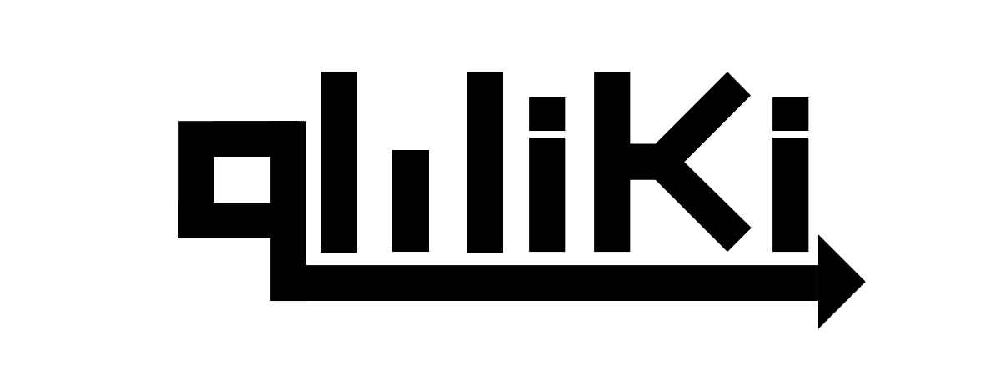

qWiki is a platform that provides a quick and easy way to host your own scalable Wiki. With the Builder Tool, you can easily generate dynamic informative Wikis and publish them for others to read or contribute.


| Table of Contents |
| ------------- |
| [Technologies Used](https://github.com/ragobash/qwiki#technologies-used) |
| [Usage](https://github.com/ragobash/qwiki#usage) |
| [Contributing](https://github.com/ragobash/qwiki#contributing) |
| [Credits](https://github.com/ragobash/qwiki#credits) |
| [Folder Structure](https://github.com/ragobash/qwiki#folder-structure) |
| [License](https://github.com/ragobash/qwiki#license) |


## Technologies Used
* [Axios](https://www.npmjs.com/package/axios)
* [Bcrypt](https://www.npmjs.com/package/bcrypt)
* [Express](https://expressjs.com/)
* [Heroku](https://devcenter.heroku.com/categories/reference)
* [Javascript](https://devdocs.io/javascript/)
* [Material UI](https://material-ui.com/)
* [Mongo](https://docs.mongodb.com/)
* [Mongoose](https://mongoosejs.com/docs/api.html)
* [React](https://reactjs.org/docs/getting-started.html)
* [Redux](https://redux.js.org/)

## Usage

/// FILLER TEXT

## Contributing
Pull requests are welcome. For major changes, please open an issue first to discuss what you would like to change.

Please make sure to update tests as appropriate.

## Credits
* [Andrew Brooking](https://github.com/AndrewBrooking)
* [Joshua Munoz](https://github.com/Joshmunoz63)
* [Ryan Harris](https://github.com/ragobash)

## Folder Structure
```
qwiki
│    README.md
│    LICENSE.txt
│    package.json
│    server.js
└─── app
│    └─── models
│    │      index.js
│    │      Pages.js
│    │      PermissionsEnum.js
│    │      Qwikis.js
│    │      SectionTypesEnum.js
│    │      Users.js
│    └─── queries
│    │      index.js
│    │      create.js
│    │      read.js
│    │      update.js
│    └─── routes
│           index.js
│           apiRoutes.js
└─── client
     │    package.json
     └─── public
     │    │    index.html
     │    │    manifest.json
     │    └─── images/
     │           favicon.png
     │           logo.png
     └─── src
            App.css
            App.js
            App.test.js
            index.css
            index.js
            registerServiceWorker.js
```

## License
qWiki Copyright (C) 2019  Andrew Brooking, Josh Munoz, and Ryan Harris

This program is free software: you can redistribute it and/or modify
it under the terms of the GNU General Public License as published by
the Free Software Foundation, either version 3 of the License, or
(at your option) any later version.

This program is distributed in the hope that it will be useful,
but WITHOUT ANY WARRANTY; without even the implied warranty of
MERCHANTABILITY or FITNESS FOR A PARTICULAR PURPOSE.  See the
GNU General Public License for more details.

You should have received a copy of the GNU General Public License
along with this program.  If not, see <https://www.gnu.org/licenses/>.
